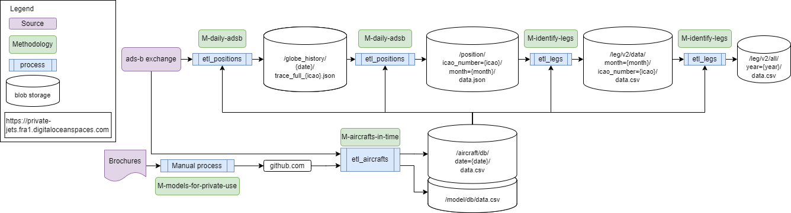

# Private jet flights
[](https://github.com/jorgecardleitao/private-jets/actions/workflows/test.yaml)
[](https://codecov.io/gh/jorgecardleitao/private-jets)

This repository contains a CLI application to analyze flights of private jets.
See [`methodology.md`](./methodology.md) for details of what it does and where data is available for consumption.

It is supported by an S3 Blob storage container for caching data, thereby
reducing its impact to [https://adsbexchange.com/](https://adsbexchange.com/).



## Risk and impact

This code performs API calls to [https://adsbexchange.com/](https://adsbexchange.com/),
a production website of a company.

**Use critical thinking** when using this code and how it impacts them.

We strongly recommend that if you plan to perform large scale analysis (e.g. in time or aircrafts),
that you reach out via an issue _before_, so that we can work together
to cache all hits to [https://adsbexchange.com/](https://adsbexchange.com/)
on an horizontally scaled remote storage and therefore remove its impact to adsbexchange.com
of future calls.

All cached data is available on S3 blob storage at endpoint

> `https://private-jets.fra1.digitaloceanspaces.com`

and has anonymous and public read permissions.

## Getting starter

1. Install Rust
2. run `cargo run --features="build-binary" --release --bin etl_aircrafts`
3. open `database/aircraft/db/date=<today date>/data.csv`

Step 2. has an optional arguments, `--access-key`, `--secret-access-key`, specifying
credentials to write to the remote storate, as opposed to disk.

Finally, setting `--backend disk` ignores the remote storage altogether and
only uses disk for caching (resulting in higher cache misses and thus more
interactions with ADS-B exchange).

In general:
* Use the default parameters when creating ad-hoc stories
* Use `--access-key` when improving the database with new data.
* Use `--backend disk` when testing the caching system

As of today, the flag `--access-key` is only available when the code is executed
from `main`, as writing to the blob storage must be done through a controlled code base
that preserves data integrity.

### Examples:

```bash
# Create new snapshot of database of all aircrafts
cargo run --features="build-binary" --release --bin etl_aircrafts -- --access-key=DO00AUDGL32QLFKV8CEP --secret-access-key=$(cat secrets.txt)

# Build database of positions `[2020, 2023]`
cargo run --features="build-binary" --release --bin etl_positions -- --access-key=DO00AUDGL32QLFKV8CEP --secret-access-key=$(cat secrets.txt)
# they are available at
# https://private-jets.fra1.digitaloceanspaces.com/position/icao_number={icao}/month={year}-{month}/data.json

# Build database of legs `[2020, 2023]` (over existing positions computed by `etl_positions`)
cargo run --features="build-binary" --release --bin etl_legs -- --access-key=DO00AUDGL32QLFKV8CEP --secret-access-key=$(cat secrets.txt)
# they are available at
# https://private-jets.fra1.digitaloceanspaces.com/leg/v1/data/icao_number={icao}/month={year}-{month}/data.csv
```
