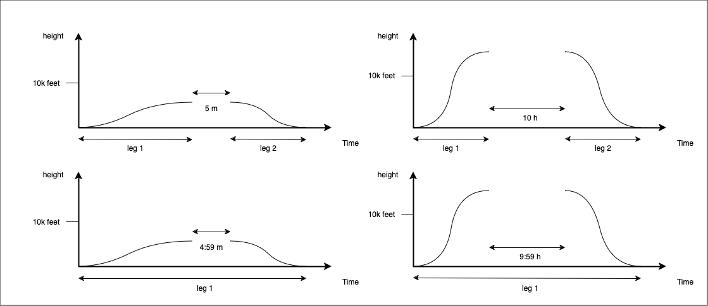

# Methodology

This document describes the general methodology used by this solution.

## Notation

* [ICAO](https://en.wikipedia.org/wiki/International_Civil_Aviation_Organization): International Civil Aviation Organization
* aircraft: a physical thing (i.e. the actual thing that we can touch) being operated under ICAO's regulations for civilian aviation.
* tail number: the registration number assigned to an aircraft (e.g. `OY-EUR`)
* ADS-B transponder: a device on an aircraft that emits ADS-B signals at a defined frequency (usually every 30s)
* ICAO number: an identifier (e.g. `4596B2`) set on the transponder
* ADS-B event: a signal emitted by a ADS-B transponder of an aircraft containing the ICAO number, time and position (including altitude)
* ADS-B receiver: a device that receives / listens to ADS-B signals
* [adsbexchange](https://globe.adsbexchange.com): a commercial platform used to aggregate real time ADS-B signals listened by receivers worldwide
* leg: a continuous sequence of ADS-B positions in time where the aircraft is flying

## Assumptions

* At any given point in time, an aircraft is assigned a unique a tail number (e.g. `OY-EUR`).
* At any given point in time, an aircraft is assigned a unique ICAO number (e.g. `4596B2`).
* At any given point in time, there is a one-to-one relationship between the assigned ICAO number and the assigned assigned tail number (`OY-EUR <-> 4596B2`).
* At any given point in time, [adsbexchange](https://globe.adsbexchange.com) contains the current set of aircrafts with:
  * tail number
  * ICAO number
  * Model name
* At any given point in time, a flying aircraft has its ADS-B transponder turned on.
* [adsbexchange](https://globe.adsbexchange.com) maintains and operates the historical datasets of ADS-B signals received in the platform.

## Design

* Information can only be obtained from trustworthy publicly available sources that can be easily verified.
* Statements must be referenced against either existing sources or this methodology.
* All data provided by this solution is:
  * be publicly available via https and s3 protocols (S3 endpoint `fra1.digitaloceanspaces.com`, bucket `private-jets`)
  * be serialized in computer and human-readable formats (`csv` or `json`)

## Methodology

The methodology used to support this solution is the follows:

### M-country-of-registration: Country of ICAO number

The country of a ICAO number is computed using ICAO's official mapping, see Appendix A of [ICAO working paper NACC/DCA/3 – WP/05](https://www.icao.int/Meetings/AMC/MA/NACC_DCA03_2008/naccdca3wp05.pdf).

The source code is available at [src/country.rs](./src/country.rs).

### M-aircrafts-in-time: Dataset of all aircrafts at a given point in time

This solution maintains the historical record of the database of all aircrafts from adb-s exchange, updated with a frequency of about 1 every month.

The dataset is available at `https://private-jets.fra1.digitaloceanspaces.com/aircraft/db/date={date}/data.csv` where date is `yyyy-mm-dd` of the
date of the extraction. It contains the following columns and types:

```yaml
columns:
  icao_number:
    type: string
    description: The ICAO number
  tail_number:
    type: string
    description: The tail number
  type_designator:
    type: string
    description: The type designator
  model:
    type: string
    description: The model name
  country:
    type: string | null
    description: The country of registration computed using `M-country-of-registration`
constraints:
  - type: uniqueness
    columns: [icao_number]
  - type: uniqueness
    columns: [tail_number]
```

The source code used to extract is available at [src/aircraft.rs](./src/aircraft.rs) and [src/bin/etl_aircrafts.rs](./src/bin/etl_aircrafts.rs).

### M-models-for-private-use: aircraft models for private use

This solution maintains a dataset of all aircraft models whose primary use is to be a private use, and their fuel consumption.
This dataset is maintained manually and consisted in the following process:

* search on the web for websites of companies that sell private jets
* access websites and each aircraft model being sold
* map the model name in the website to the model name in `M-aircrafts-in-time`
* extract the consumption in gallons per hour (GPH) of each model
* store it in a table with the jet's model, GPH, source and date of extraction, at [`./src/models.csv`](./src/models.csv).

For example, `Dassault Falcon 2000` is advertised and sold as a private jet [here](https://www.guardianjet.com/jet-aircraft-online-tools/aircraft-brochure.cfm?m=Dassault-Falcon-2000-92).

This dataset is available at `https://private-jets.fra1.digitaloceanspaces.com/model/db/data.csv`. It contains the following columns and types:

```yaml
columns:
  model:
    type: string
    description: The model name
  gph:
    type: string
    description: The gallons per hour (of jet fuel) used by this model as advertised in source
  source:
    type: string
    description: The source of this information
  date:
    type: string
    description: The date of extraction in `yyyy-mm-dd`
constraints:
  - type: uniqueness
    columns: [source]
```

**NOTE**: not all uses of a model whose primary use is to be a private jet is
for private use. For example, models are sometimes used for emergency services.

### M-daily-adsb: ICAO number's ADS-B events

This solution maintains a dataset of all historical ADS-B signals from adsbexchange for the set of all private jets since 2019.

The set of ICAO numbers of private jets at a given date is computed by combining `M-aircrafts-in-time` and `M-models-for-private-use`.

From this methodology results two datasets:
* dataset parameterized by (ICAO number, day), available at `https://private-jets.fra1.digitaloceanspaces.com/globe_history/{date}/trace_full_{icao}.json` where
  `{date}` (`yyyy-mm-dd`) is the corresponding day and `{icao}` the ICAO number.
* dataset parameterized by (ICAO number, month), available at `https://private-jets.fra1.digitaloceanspaces.com/position/icao_number={icao}/month={month}/data.json` where
  `{month}` (`yyyy-mm`) is the month and `{icao}` the ICAO number.

Note that these datasets comprise of >1.5 TB of data.

The source code is available at

* [./src/icao_to_trace.rs](./src/icao_to_trace.rs)
* [./src/trace_month.rs](./src/trace_month.rs)
* [src/bin/etl_positions.rs](./src/bin/etl_positions.rs).

### M-identify-legs: Identify legs from sequences of ADS-B events

This solution maintains a dataset of all legs computed from the signals in `M-daily-adsb` computed as follows:

* map ADS-B events from `M-daily-adsb` into a sequence of events corresponding to a leg
* aggregate a sequence into metrics of the leg

#### Heuristic for ADS-B events where aircraft landed

To identify legs, this methodology uses an heuristic to identify whether the aircraft has landed.
Given an event and its previous event, the aircraft is considered to have landed if and only if any of the below is true:

1. previous event has `altitude > 0` and event has `altitude = 0`
2. any of the events have `0 < altitude < 10.000 feet` and the duration between events is > 5 minutes
3. any of the events have `altitude ≥ 10.000 feet` and the duration between events is > 10 hours

Condition 1. is the normal case.
Condition 2. is used to mitigate the risk of missing a landing resultant from ADS-B receivers not always receive ADS-B signal from low altitudes.
Condition 3. is used to mitigate situations where the aircraft enters regions
of low ADS-B coverage (e.g. central Africa) while flying and then returns flying
(sometimes days later), which should not be intepreted as the aircraft flying
for the whole time.



#### Heuristic for ADS-B events where aircraft is on the ground

To identify legs, this methodology uses an heuristic to identify whether the aircraft is on the ground.
Given an event and its previous event, the aircraft is considered to be on the ground if and only if any of the below is true:

1. previous event has `altitude = 0` and event has `altitude = 0`
2. any of the events have `0 < altitude < 10.000 feet` and the duration between events is > 5 minutes
3. any of the events have `altitude ≥ 10.000 feet` and the duration between events is > 10 hours

Condition 1. is the normal case. Condition 2 and 3 have the same rationale as above.

#### Identify a leg

A leg is identified as a non-empty sequence of ADS-B events whereby the aircraft is not on the ground and the aircraft has landed at the last segment.
Specifically,
given positions `p_1,p_2,...,p_n` ordered by timestamp,
and two events `p_m` and `p_q` (where `p_1 ≤ p_m < p_q ≤ p_n`)
when `(p_m,p_m+1)` is identified as not on the ground
and `(p_q-1,p_q)` is identified as the aircraft having landed
and no other position between `p_m` and `p_q` are on the ground
then the sequence `p_m,...,p_q` is a leg.

The result of this approach is that a leg is a sequence of ADS-B events of the form "grounded, flying, ..., flying, grounded".

Source code is available at [src/legs.rs](./src/legs.rs).

#### Aggregate metrics

Given a leg, this solution aggregates specific metrics about it that can be used to large-scale analysis without using the individual events.

This dataset is available at `https://private-jets.fra1.digitaloceanspaces.com/leg/v2/data/month={month}/icao_number={icao}/data.csv` on a per month and ICAO number,
and `https://private-jets.fra1.digitaloceanspaces.com/leg/v2/all/year={year}/data.csv` per year for all ICAO numbers.
It contains the following columns and types:

```yaml
columns:
  icao_number:
    type: string
    description: The ICAO number (e.g. 4596b2)
  start:
    type: string
    description: The datetime of the start of the leg in rfc3339 in UTC
  start_lat:
    type: f64
    description: The latitude at the start of the leg in ISO 6709 decimal
  start_lon:
    type: f64
    description: The longitude at the start of the leg in ISO 6709 decimal
  start_altitude:
    type: f64
    description: The altitude at the start of the leg in feet
  end:
    type: string
    description: The datetime of the end of the leg in rfc3339 in UTC
  end_lat:
    type: f64
    description: The latitude at the end of the leg in ISO 6709 decimal
  end_lon:
    type: f64
    description: The longitude at the end of the leg in ISO 6709 decimal
  end_altitude:
    type: f64
    description: The altitude at the end of the leg in feet
  length:
    type: f64
    description: The total actual flown distance in km (always bigger than the great-circle distance between start and end)
  hours_above_30000:
    type: f64
    description: number of hours flown above 30.000 feet
  hours_above_40000:
    type: f64
    description: number of hours flown above 40.000 feet
constraints:
  - type: uniqueness
    columns: [icao_number, start]
  - type: uniqueness
    columns: [icao_number, end]
```

Source code is available at [src/bin/etl_legs.rs](./src/bin/etl_legs.rs).
